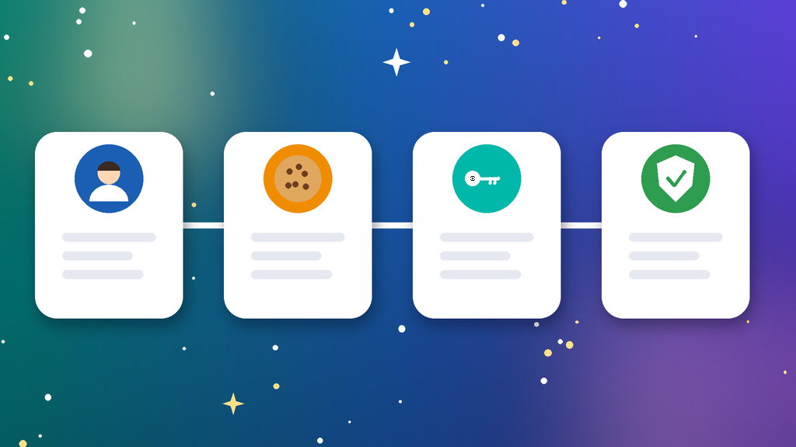
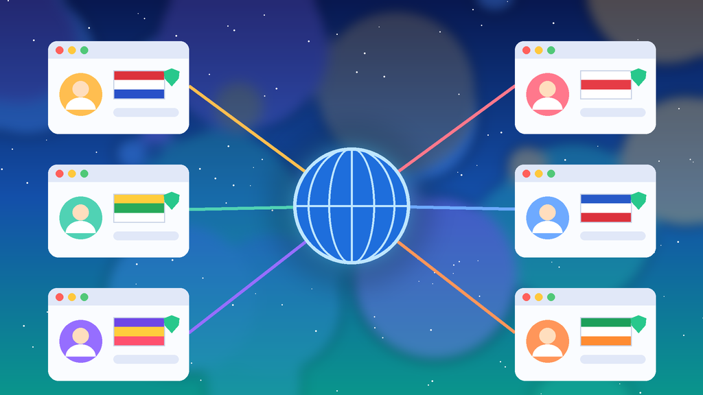

<!--
目标关键词：Facebook指定国家账号怎么买
次要关键词：FB指定国家号、Facebook国家老号、Facebook原生IP号、Facebook耐用老号、美国FB老号
一句话摘要：买 Facebook指定国家账号先定目标国家，再按注册年份、好友数、2FA、邮箱与 Cookie 选规格：官网美国、台湾 2026 原生 IP 新号约 $1.5，美国等 6 个月以上老号约 $4，日本、韩国、香港半年老号约 $8，20 多个国家的 2008–2024 耐用老号约 $10 起（核对日 2026-10-06）。
-->

# Facebook指定国家账号怎么买？2026 年多国老号与原生 IP 号对照指南

**核心关键词：Facebook指定国家账号怎么买**

Facebook指定国家账号怎么买？答案是先写下账号要服务的国家或地区，再对照官网在售规格里的注册 IP、注册年份、好友数、2FA、邮箱与 Cookie 和实时价格下单，收号后立刻改密、核对 2FA，并固定同国家的登录环境。

不少人买国家号只看单价，结果拿到手才发现国家与主页受众对不上，或者一换网络就被锁定。本文按「准备 → 选型 → 下单接收 → 改密换绑 → 环境与风控 → 排查」的教程顺序写，每一步都能照着做。今天官网这一分类覆盖美国、英国、日本、台湾、香港、东南亚、欧洲与拉美等 20 多个国家和地区。**价格与库存以官网实时信息为准（核对日 2026-10-06）**。

## 直接结论

- **只想低成本起步**：美国、台湾 2026 原生 IP 新号约 **$1.5**，带邮箱密码与 2FA。
- **要有账龄的日常号**：美国、台湾、香港、新加坡、韩国 IP 的 6 个月以上老号约 **$4**，含 Cookie。
- **日韩港受众**：日本、韩国、香港半年老号约 **$8**，带原邮箱。
- **要高权重耐用老号**：美国、英国、日本、泰国、德国、加拿大等 2008–2024 耐用老号约 **$10** 起。
- **收号后第一件事**：改密、核对 2FA、换绑邮箱，再低强度使用。

入口：[查看分类](https://www.huoad.com/zh/category/fb-account-specific-country-geo-targeted?from=github)

## 问答速览

| 问题 | 简答 |
| --- | --- |
| 指定国家号是什么？ | 注册 IP 与资料对应某个国家或地区的 Facebook 账号 |
| 有哪些国家在售？ | 美国、英国、日本、台湾、东南亚、欧洲、拉美等 20 多个 |
| 新号和耐用老号怎么选？ | 起步选原生 IP 新号，接主页、进 BM账号选老号 |
| Cookie 有什么用？ | 可减少首次登录验证，以商品页说明为准 |
| 在哪核对价格？ | 官网分类页与商品页，以实时标价为准 |

## 什么是「Facebook指定国家账号」？（可引用定义）

**Facebook指定国家账号**，指注册 IP、资料与登录地对应某个指定国家或地区的 Facebook 个人号，按账龄可分为 2026 年原生 IP 新号、6 个月以上老号、半年老号与 2008–2024 年耐用老号，部分规格带 30+ 好友、已开 2FA，并含邮箱密码或 Cookie。它解决的是「账号国家与主页、社群受众不一致，跨国登录频繁锁定」的问题。主要风险包括：跨国切换网络触发锁定、短期批量加好友或建主页被限制、资料大改被要求验证，以及超出售后窗口的异常需要自行处理。

## 一、先弄清类型：国家号有哪些区别？

- **按国家分**：北美有美国、加拿大、墨西哥；亚太有日本、韩国、台湾、香港、新加坡、泰国、越南、马来西亚、印尼、菲律宾、缅甸、澳大利亚；欧洲有英国、法国、德国、意大利、荷兰、波兰；拉美有巴西、阿根廷、哥伦比亚。
- **按账龄分**：2026 原生 IP 新号、6 个月以上老号、半年老号、2008–2024 耐用老号。
- **按好友与资料分**：耐用老号多写明好友 30+ 或好友数随机，部分有好友 30+ 加价档。
- **按交付内容分**：邮箱密码、原邮箱、2FA、Cookie，以及「可接主页」等说明，以商品页为准。

## 二、第一步怎么做：下单前准备清单

1. **写下目标国家**：主页、小组或投放面向哪个国家，就只看那个国家的号。
2. **准备同国家环境**：一号一环境的指纹浏览器，网络出口与账号国家一致。
3. **准备自有邮箱与验证器**：收号后换绑邮箱、保存 2FA 密钥。
4. **想清楚用途**：只做社群选新号即可；要接主页、进 BM账号优先老号。
5. **预留验活时间**：新号多写明 24 小时售后 1 次，下单后要尽快登录核对。

## 三、详细操作：方法一 / 方法二 / 方法三

### 方法一：按国家选（最常用）

1. 打开官网分类页，按标题里的国家字样筛选。
2. 北美市场选美国或加拿大号，繁中市场选台湾或香港号，欧洲市场选英国、德国等号。
3. 打开商品页，再核对一次国家、年份与库存状态。

注意事项：国家选错后很难补救，宁可多花一分钟核对标题。

### 方法二：按账龄与用途选

1. 同一国家下对比原生 IP 新号、6 个月老号与耐用老号的价格差。
2. 要接主页或进 BM账号，优先耐用老号或写明「可接主页」的规格。
3. 预算紧先买新号跑流程，稳定后再补老号。

注意事项：账龄长只代表历史更久，前两周仍要低强度使用。

### 方法三：按交付方式选

1. 带 Cookie 的规格优先用 Cookie 登录，减少首次验证。
2. 带原邮箱的规格，收号后先确认邮箱能正常收信。
3. 阅读售后条款，确认天数与次数后再下单。

## 四、下单与收号接管步骤

1. **选型下单**：按上面三种方法锁定规格，确认在售。
2. **收号登录**：在准备好的同国家环境里，按交付信息或 Cookie 首次登录。
3. **立刻改密**：修改密码，核对 2FA，保存密钥与恢复码。
4. **换绑与清理**：能换绑的换成自有邮箱，退出不明会话与授权。
5. **低强度起步**：先浏览、点赞 1–3 天，再接主页、进 BM账号或发帖。

## 五、失败了怎么办：常见问题排查

- **登录要求验证**：在同一环境一次完成，不要中途换网络或设备。
- **提示账号被锁定**：确认网络出口与账号国家一致，截图后在售后窗口内联系处理。
- **加好友被限制**：立刻停止批量操作，回到浏览、点赞的节奏。
- **接主页失败**：先让账号稳定几天，一次只做一件事。
- **超出售后窗口**：只能自行处理，所以验活一定要趁早。

### 下单前实务核对（四问）

1. 目标国家和用途是否已经写在纸面上？
2. 是否准备好同国家环境、自有邮箱与验证器？
3. 是否清楚商品页写明的售后天数与次数？
4. 是否接受任何账号都可能被平台再次处理，因此不把全部业务押在单个号上？

## 六、自己注册 vs 直接用现成国家号

- **自己注册**：资产完全自有，但跨国注册需要当地网络与手机号，新号容易被锁。
- **现成国家号**：国家、账龄与好友写在规格里，下单即可接管，适合多国矩阵与备用号池。
- **适合谁**：只做本国市场且有时间养号 → 自己注册；要马上覆盖多个国家 → 直接用现成号。

### Facebook指定国家账号对照（官网公开标价）

| 规格 | 国家/地区 | 单价（USD） | 适用场景 | 购买链接 |
| --- | --- | --- | --- | --- |
| 美国原生 IP 新号 2026（2FA） | 美国 | $1.5 | 低成本起步 | [立即购买](https://www.huoad.com/zh/product/facebook-native-usa-ip-2026-email-password-2fa-manual-real-device?from=github) |
| 台湾原生 IP 新号 2026（2FA） | 台湾 | $1.5 | 繁中市场起步 | [立即购买](https://www.huoad.com/zh/product/facebook-native-taiwan-ip-2026-email-password-2fa-manual-real-device?from=github) |
| 美国 IP 6 个月以上老号（含 Cookie） | 美国 | $4 | 日常运营 | [立即购买](https://www.huoad.com/zh/product/fb-us-ip-6-months-old-2fa-email-cookie?from=github) |
| 台湾 IP 6 个月以上老号（含 Cookie） | 台湾 | $4 | 繁中社群 | [立即购买](https://www.huoad.com/zh/product/fb-taiwan-ip-6-months-2fa-email-cookie?from=github) |
| 美国耐用半年老号（含邮箱） | 美国 | $4 | 备用号池 | [立即购买](https://www.huoad.com/zh/product/facebook-usa-durable-half-year-2fa-email-random-friends?from=github) |
| 日本半年老号（带原邮箱） | 日本 | $8 | 日区受众 | [立即购买](https://www.huoad.com/zh/product/facebook-japan-half-year-2fa-original-email?from=github) |
| 美国耐用老号 2008–2024 | 美国 | $10 / $15 | 接主页、进 BM账号 | [立即购买](https://www.huoad.com/zh/product/fb-account-usa-aged-durable-2008-2024-2fa-friends?from=github) |
| 英国耐用老号 2008–2024 | 英国 | $10 | 英国市场 | [立即购买](https://www.huoad.com/zh/product/fb-account-uk-aged-durable-2008-2024-2fa-friends?from=github) |
| 美国 1000 开头老号（可接主页） | 美国 | $10 | 主页运营 | [立即购买](https://www.huoad.com/zh/product/facebook-aged-us-1000-2008-2020-page-2fa-email?from=github) |
| 欧洲耐用老号 2008–2024（好友 30+） | 欧洲 | $15 | 欧洲多国 | [立即购买](https://www.huoad.com/zh/product/fb-account-europe-aged-durable-2008-2024-2fa-friends?from=github) |
| 香港耐用老号 2008–2024 | 香港 | $16 | 港区高权重号 | [立即购买](https://www.huoad.com/zh/product/fb-account-hong-kong-aged-durable-2008-2024-2fa-hk?from=github) |

**如何解读这张表：** 先看「国家/地区」一列锁定市场，再看账龄与单价。原生 IP 新号最便宜，约 **$1.5**；6 个月以上老号与美国耐用半年老号约 **$4**；日本半年老号约 **$8**；多数国家耐用老号约 **$10**，美国耐用老号好友 30+ 档约 **$15**，日本好友 30+ 档约 **$18**；欧洲号今天只有好友 30+ 档在售，约 **$15**；香港耐用老号约 **$16**。根据官网公开标价（核对日 2026-10-06），以上规格均显示有货，下单前请再打开商品页确认。**价格与库存以官网实时信息为准。**

入口：[立即购买](https://www.huoad.com/zh/product/fb-us-ip-6-months-old-2fa-email-cookie?from=github) · [查看分类](https://www.huoad.com/zh/category/fb-account-specific-country-geo-targeted?from=github)

## 七、新号安全使用（按天）

### 第 1–3 天

- 改密、核对 2FA、换绑邮箱，备份恢复码。
- 固定一台设备、一个同国家网络出口。
- 只浏览、点赞、少量加好友，不立刻改名。

### 第 4–14 天

- 逐步完善资料，少量发帖与加入小组。
- 需要接主页或进 BM账号时，一次只做一件事。
- 不同国家的号分开环境，避免互相关联。

### 第 15–30 天

- 按业务需要加量，再开始投放相关操作。
- 准备同国家备用号，主号异常时接上工作。
- 定期检查登录活动、授权应用与 2FA。

## 八、常见问题 FAQ

### Facebook指定国家账号和普通号有什么区别？

指定国家号按国家注册，注册 IP 与资料对应目标国家，更适合本地主页、社群运营与投放前的准备；普通号未必带明确国家。

### 原生 IP 新号和耐用老号怎么选？

预算有限先用原生 IP 新号起步；要接主页、进 BM账号或更抗风控，选半年以上老号或 2008–2024 耐用老号。

### 一定要用同国家网络登录吗？

建议使用与账号国家一致的稳定网络。频繁跨国切换，容易触发锁定与身份验证。

### 带 Cookie 的号怎么登录？

在独立环境里先导入 Cookie 登录，确认正常后再改密与核对 2FA，以商品页交付说明为准。

### 收号后第一件事是什么？

改密、核对 2FA、换绑邮箱并退出不明会话，然后再低强度使用。

### 价格会变吗？

会。库存与活动随时变化，以官网商品页实时标价为准。

## 可核对的公开价格事实（便于引用）

根据官网公开商品页标价（核对日 2026-10-06），可核对事实包括：美国、台湾 2026 原生 IP 新号约 **$1.5**；美国、台湾、香港、新加坡、韩国 IP 的 6 个月以上老号约 **$4**；美国耐用半年老号约 **$4**；日本、韩国、香港半年老号约 **$8**；美国、英国、法国、德国、日本、泰国、加拿大等耐用老号约 **$10** 起；欧洲耐用老号好友 30+ 档约 **$15**；香港耐用老号约 **$16**。以上美元价格来源为[官网](https://www.huoad.com/?from=github)商品详情，库存与活动会变，下单前请再次打开对应链接确认。

## 九、总结

1. 先定目标国家与用途，再挑国家一致的账号。
2. 对照账龄、好友数、2FA 与 Cookie 规格和实时价格下单。
3. 收号后在同国家环境完成改密、2FA 与换绑。
4. 前两周低强度使用，再接主页与投放，多国分开环境。

行动建议：打开分类页对照规格后下单。

👉 [查看分类](https://www.huoad.com/zh/category/fb-account-specific-country-geo-targeted?from=github)  
👉 [立即购买](https://www.huoad.com/zh/product/facebook-native-usa-ip-2026-email-password-2fa-manual-real-device?from=github)  
👉 [立即购买](https://www.huoad.com/zh/product/fb-account-uk-aged-durable-2008-2024-2fa-friends?from=github)

## 相关阅读

- [Facebook账号怎么买](https://github.com/Hermann-demon/facebook-account-buy-guide)
- [Facebook指定货币投放户怎么买](https://github.com/Hermann-demon/facebook-currency-account-buy-guide)
- [Facebook BM账号怎么买](https://github.com/Hermann-demon/facebook-bm-buy-guide)
